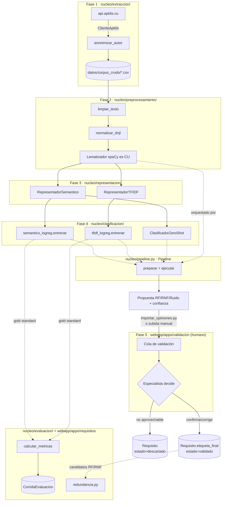

# ARQUITECTURA_ACTUAL.md — Estado real del código (Fase 0)

> Generado como red de seguridad antes de escalar el prototipo. A diferencia de
> `docs/ARQUITECTURA.md` (propuesta/aspiracional), este documento describe **lo que el
> código hace hoy**, verificado leyendo cada módulo — no lo que declaran los docstrings o
> la hoja de ruta. Fecha de este corte: 2026-08-18, commit `1a1b354`.

## 1. Veredicto rápido

El método (`nucleo/`) **no es un stub**: las 5 fases están implementadas y funcionan de
extremo a extremo, con una suite de 16 archivos de test (~1250 líneas) que ya cubre DNJL,
preprocesamiento, TF-IDF, semántico, zero-shot, el orquestador `Pipeline` y la API REST.
`webapp/` es un envoltorio Django delgado que de verdad delega en `nucleo/` (no reimplementa
lógica). El desacople `nucleo/` ↔ Django declarado en `CLAUDE.md` se respeta en la práctica:
ningún archivo de `nucleo/` importa Django.

## 2. Mapa de módulos y responsabilidad real

### `nucleo/extraccion/` — Fase 1
| Archivo | Responsabilidad real |
|---|---|
| `apklis.py` | `ClienteApklis`: cliente HTTP paginado (DRF limit/offset) contra `https://api.apklis.cu/`, sin auth. Espera 1 s entre peticiones, User-Agent identificable. Dos métodos: `listar_aplicaciones()`, `listar_opiniones(package_name)`. |
| `anonimizacion.py` | `anonimizar_autor()`: HMAC-SHA256 del username (16 hex chars), sal desde `MIA_SAL_ANONIMIZACION` o una sal fija de desarrollo. Se aplica **antes** de tocar disco. |
| `corpus.py` | `construir_corpus()` + `guardar_csv()`: baja reseñas, descarta las de comentario vacío, anonimiza, escribe CSV en `datos/corpus_crudo/` (columnas fijas en `CAMPOS_CSV`). CLI: `python -m nucleo.extraccion.corpus --paquete <pkg>`. |

### `nucleo/preprocesamiento/` — Fase 2
| Archivo | Responsabilidad real |
|---|---|
| `limpieza.py` | `limpiar_texto()`: quita URLs y menciones `@user`, colapsa repeticiones de carácter/sílaba (`graciaaaas`→`graciaas`), normaliza espacios. **No** quita emojis (señal de sentimiento). |
| `dnjl.py` | Diccionario de Normalización de Jerga Local — 4 categorías fijas (`NEOLOGISMOS_TECNOLOGICOS`, `ABREVIATURAS_INFORMALES`, `ERRORES_FONETICOS_ORTOGRAFICOS`, `LEMATIZACION_VERBOS`), 15 entradas en total hoy. `normalizar_dnjl()` sustituye con regex `\b(...)\b` case-insensitive, compilando el patrón una vez a nivel de módulo. |
| `lematizador.py` | `Lematizador`: envoltorio sobre `spacy.load(modelo, disable=["ner","parser"])`. Requiere `.cargar()` explícito antes de `.lematizar()` (lanza `RuntimeError` si no). `MODELO_DEFECTO = "es_core_news_sm"` es la **única fuente de verdad** del modelo de spaCy por defecto del proyecto: `nucleo/pipeline.py` y `webapp/config/settings.py` lo reexportan en vez de declarar su propio valor (corregido en la Fase 0 de escalado, 2026-08-19 — antes divergían hacia `es_core_news_md`, un modelo que nunca estuvo instalado; ver §7). |
| `__init__.py` | `preprocesar(texto, lematizador)` encadena `limpiar_texto → normalizar_dnjl → lematizador.lematizar`. Es la función que usa todo lo demás. |

### `nucleo/representacion/` — Fase 3
| Archivo | Responsabilidad real |
|---|---|
| `semantica.py` | `RepresentadorSemantico`: envoltorio sobre `SentenceTransformer`. Fuerza `HF_HUB_OFFLINE=1`/`TRANSFORMERS_OFFLINE=1` al cargar (evita cuelgues sin red). Soporta backend `torch` (por defecto) u `onnx` con `archivo_modelo` cuantizado. Modelo por defecto en todo el repo: `sentence-transformers/paraphrase-multilingual-MiniLM-L12-v2`. |
| `tfidf.py` | `RepresentadorTFIDF`: envoltorio sobre `TfidfVectorizer(max_features=5000, ngram_range=(1,2), sublinear_tf=True)`. Línea base de la hipótesis. |

### `nucleo/clasificacion/` — Fase 4
| Archivo | Responsabilidad real |
|---|---|
| `zero_shot.py` | `ClasificadorZeroShot`: **no entrena nada**. Similitud coseno contra 3 frases prototipo por clase (`PROTOTIPOS`), softmax sobre la similitud máxima como "confianza" (no calibrada). Es lo que usa hoy toda la webapp (`ClasificarAPIView`, subida manual) porque no hay un clasificador entrenado configurado por defecto. |
| `tfidf_logreg.py` | `entrenar()`: `train_test_split` estratificado (`test_size=0.2`, `random_state=42` por defecto) + `LogisticRegression(class_weight="balanced", max_iter=1000)`. CLI persiste con `joblib.dump({"vectorizador", "clasificador", ...})` en `datos/modelos/`. |
| `semantico_logreg.py` | Igual patrón que `tfidf_logreg.py` pero con embeddings. **Crítico para la tesis:** el split usa literalmente el mismo `train_test_split(indices, textos, etiquetas, test_size, random_state, stratify)` en el mismo orden que `tfidf_logreg.py`, verificado por test (`test_mismo_split_exacto_que_tfidf_logreg`) — sin esto la comparación semántico vs. TF-IDF no sería válida. |

### `nucleo/evaluacion/` — Fase de evaluación / apoyo a fase 5
| Archivo | Responsabilidad real |
|---|---|
| `metricas.py` | `calcular_metricas()`: envoltorio sobre `classification_report`/`confusion_matrix` de sklearn, fijando `labels=["RF","RNF","Ruido"]` y `zero_division=0`. Redondea a 4 decimales. `comparar_corridas()` devuelve el índice de mejor F1 de una lista de corridas. |
| `muestra_validacion.py` | Genera el CSV que un humano valida (fase 5): muestreo estratificado por `calificacion`, limpieza+DNJL, propuesta zero-shot, columnas `etiqueta_validada`/`notas_validador` vacías a propósito. |
| `redundancia.py` | Mide si la representación semántica agrupa parafraseos mejor que TF-IDF: `AgglomerativeClustering(metric="cosine", linkage="average")` barriendo el umbral de distancia sobre los candidatos RF/RNF del gold standard. Umbral operativo fijado en `0.30` tras inspección manual (documentado en la bitácora). Soporta comparar contra un agrupamiento manual de referencia (ARI, homogeneidad, completitud). |

### `nucleo/scripts/` — puentes CLI (ninguno importa Django salvo al ejecutarse)
| Archivo | Responsabilidad real |
|---|---|
| `exportar_propuestas.py` | Aplica preprocesamiento + zero-shot a un corpus completo, con progreso impreso cada 50 filas, exporta CSV plano. |
| `importar_opiniones.py` | Puente CSV → BD: crea `Opinion`+`Requisito(estado="propuesto")` en la webapp. **Decisión de diseño explícita:** aunque el CSV de origen (p. ej. el gold standard) ya traiga `etiqueta_final`, la importación la ignora — todo entra como "propuesto" para no simular una validación humana que no ocurrió en la webapp. |
| `registrar_corrida.py` | Entrena+evalúa (tfidf o semántico) sobre el gold standard y persiste una fila en `CorridaEvaluacion` para verla en `/evaluacion/`. |

### `nucleo/pipeline.py` — orquestador de fases 2-4
`Pipeline` (dataclass): `preparar()` decide la estrategia según los argumentos —
- sin `ruta_modelo` + `metodo="semantico"` → cae a zero-shot (sin entrenar).
- con `ruta_modelo` → carga el `.joblib` correspondiente (clave `"vectorizador"` para tfidf, `"representador"` para semántico).
- `metodo="tfidf"` sin `ruta_modelo` → `ValueError` explícito (TF-IDF no tiene equivalente zero-shot: su vocabulario debe ajustarse de antemano).

`ejecutar()` aplica `preprocesar()` a cada texto y despacha a `.proponer()` (zero-shot) o `.predict()+.predict_proba()` (modelo entrenado), devolviendo `list[Propuesta]`.

### `webapp/` — envoltorio Django (MTV + DRF)
| App | Modelos | Responsabilidad real |
|---|---|---|
| `opiniones` | `Opinion` | Corpus de solo lectura + subida manual CSV/JSON (`pipeline.py` de la app, que **reusa** `nucleo.pipeline.Pipeline` cacheado con `@lru_cache`, no reimplementa nada). `GET /api/opiniones/?aplicacion=`, `POST /api/clasificar/` (no persiste, solo propone). |
| `validacion` | `Requisito` | Cola de validación humana (fase 5): vista `ColaValidacionView`, `validar`/`descartar` (web y `POST /api/requisitos/{id}/validar/`), compartiendo `_registrar_decision()` entre ambos caminos. `estado` ∈ {propuesto, validado, descartado}; descartar **no** fuerza a "Ruido". |
| `requisitos` | `CorridaEvaluacion` | Panel de métricas (`/evaluacion/`), export CSV para el documento de tesis, `GET /api/evaluacion/`. `es_mejor_que_baseline` compara contra el mejor F1 de método `tfidf` registrado. |
| `usuarios` | — | **Vacía**: `models.py` sin clases, `views.py` solo el import, `urls.py = []`. El rol de usuario (administrador/especialista/analista) de `docs/PROYECTO.md` §8 **no está implementado** — hoy todo pasa por `django.contrib.auth` genérico + `/admin/login/`. |

`webapp/config/settings.py`: lee todo por variable de entorno vía `python-decouple`; `DJANGO_SECRET_KEY` **no tiene default** (falla duro sin `.env`). `DATABASES` apunta a Postgres únicamente, sin fallback sqlite — implicación directa para CI (ver §5).

## 3. Diagrama de flujo de datos

## 4. Acoplamiento a Apklis / dominio de apps móviles

Puntos concretos que habría que tocar para generalizar el método a otro dominio de opiniones
(otra tienda, otro tipo de producto):

**Extracción (fuerte, esperado — es la fase 1 específica de fuente):**
- `nucleo/extraccion/apklis.py`: URL fija `https://api.apklis.cu/`, rutas `v2/application/`, `v2/review/`, parámetro `application=<package_name>`, campos de la respuesta (`comment`, `rating`, `published`, `version`, `user.username`).
- `nucleo/extraccion/corpus.py`: campos `OpinionCruda` asumen ese JSON (`reseña.get("application")`, `reseña.get("version")`), `fuente: str = "apklis"` como valor por defecto hardcodeado.

**Modelo de datos (moderado):**
- `webapp/apps/opiniones/models.py`: campo `Opinion.aplicacion` (nombre genérico, pero semánticamente es "qué app móvil"), sin campo equivalente para otro tipo de "producto reseñado".
- `nucleo/scripts/importar_opiniones.py`: rutas por defecto `datos/corpus_crudo/cu.uci.android.apklis.csv` embebidas como constantes.

**Clasificador zero-shot (fuerte, pero centralizado en un solo lugar):**
- `nucleo/clasificacion/zero_shot.py` → `PROTOTIPOS`: las 9 frases prototipo (3 por clase) están escritas pensando en apps móviles ("la aplicación se cierra sola, se congela...", "consume muchos datos o batería"). Migrar de dominio implica reescribir este diccionario, pero está aislado y es el único lugar que hace falta tocar en `clasificacion/`.

**DNJL (fuerte y disperso por diseño, es jerga *cubana*, no de apps):**
- `nucleo/preprocesamiento/dnjl.py`: 16 entradas de jerga/errores. Algunas son de dominio tecnológico general ("pincha"→"funciona", "crashea"→"falla", "lag"→"retraso") y trasladan bien a cualquier software; otras son jerga cubana genérica sin relación con apps ("aser"→"hacer", "xq"→"porque"). No hace falta tocarlo para cambiar de tienda de apps, sí para cambiar de país/variante de español.

**Interfaz web (fuerte, es texto de UI, no lógica):**
- `webapp/templates/base.html`: título "Requisitos desde Apklis", paleta Tailwind con namespace `apklis-*` (`bg-apklis-600`, `bg-apklis-900`, etc. — colores de marca, no solo naming).
- `webapp/templates/opiniones/lista.html`: "Opiniones extraídas de Apklis (fase 1)...".
- `webapp/templates/opiniones/subir.html`: botón con clase `bg-apklis-600`.
- Ninguna plantilla asume texto de reseña de app específicamente (son genéricas "opinión"/"texto"), así que el acoplamiento de plantillas es solo de branding/copy, no estructural.

**Gold standard / evaluación (ninguno funcional, pero los datos sí son de este dominio):**
- `datos/gold_standard_privado/gold_standard_v1.csv` son 501 opiniones reales de apps de Apklis ya validadas — es un activo específico del dominio actual, no reutilizable para otro corpus sin re-etiquetar.

## 5. Dependencias externas y versiones

Fuente de verdad hoy: `requirements-lock.txt` (exportado con `pip freeze`, versiones exactas).
`pyproject.toml` declara las mismas dependencias pero con mínimos (`>=`), no exactos —
ver bitácora, tarea de Fase 0 de anclar versiones.

| Paquete | Versión | Uso |
|---|---|---|
| Django | 6.0.6 | Framework web (MTV) |
| djangorestframework | 3.17.1 | API REST |
| psycopg2-binary | 2.9.12 | Driver Postgres |
| python-decouple | 3.8 | Config por variables de entorno |
| spacy | 3.8.13 | Preprocesamiento lingüístico (fase 2) |
| sentence-transformers | 5.6.0 | Embeddings semánticos (fase 3) |
| transformers | 5.12.1 | Backend de sentence-transformers |
| torch | 2.12.1 | Backend de transformers (dependencia pesada) |
| scikit-learn | 1.9.0 | TF-IDF, LogisticRegression, métricas, clustering |
| numpy | 2.5.0 | Álgebra vectorial |
| scipy | 1.18.0 | Dependencia de sklearn |
| pandas | 3.0.3 | Lectura/escritura de CSV, DataFrames |
| requests | 2.34.2 | Cliente HTTP de extracción |
| joblib | 1.5.3 | Persistencia de modelos entrenados (.joblib) |
| pytest | 9.1.1 | Test runner |
| pytest-django | 4.12.0 | Integración pytest + Django (fixture `django_db`) |
| pytest-cov | 7.1.0 | Cobertura de pruebas |

Modelos de PLN (no son paquetes pip, se descargan aparte y se cachean localmente):
- **spaCy:** `es_core_news_sm`, único modelo soportado y único que ha estado instalado alguna vez en este proyecto (ver §7 — hasta la Fase 0 de escalado, `webapp/config/settings.py` y `nucleo/pipeline.py` declaraban por su cuenta `es_core_news_md`, nunca instalado; ya unificado a una sola fuente de verdad).
- **Sentence-Transformers:** `sentence-transformers/paraphrase-multilingual-MiniLM-L12-v2`, con soporte opcional para variante ONNX cuantizada vía `--backend onnx --archivo-modelo`.

**Nota de reproducibilidad (corregida en esta misma Fase 0):** `requirements-lock.txt`
contenía la línea `-e d:\proyectos\mia` (instalación editable con ruta absoluta de esta
máquina), que rompía la instalación en cualquier otro entorno. Ahora es `-e .`
(relativa a la raíz del repo).

## 6. Otros hallazgos de la Fase 0 (no bloqueantes, para la bitácora)

- **Inconsistencia de modelo spaCy por defecto — corregida (ver §7).**
- **`files (1).zip` en la raíz del repo:** un zip de 20 KB con copias de `CLAUDE.md`/`PROYECTO.md`/`ARQUITECTURA.md`/`GLOSARIO.md`/`bitacora-experimentos.md`, commiteado (`git log` lo confirma desde el primer commit). No es sensible, pero es ruido — probablemente un adjunto de subida accidental.
- **`webapp/templates/base.html` dice "Python 3.14 · Django 6"** en el pie de página, mientras `CLAUDE.md` fija Python 3.12 como stack. Texto suelto, no afecta al runtime, pero es información incorrecta visible en la UI.
- **App `usuarios` sin implementar:** el modelo de roles (administrador/especialista/analista) de `docs/PROYECTO.md` §8 no existe en código. Hoy cualquier usuario autenticado de Django puede validar/descartar vía la API (`IsAuthenticated`, no un permiso por rol) — ya está anotado como pendiente en la bitácora del 2026-08-14.
- **`nucleo/` realmente no importa Django** (verificado por grep, no solo por convención) — el principio rector de `docs/ARQUITECTURA.md` §1 se cumple en código, no solo en la intención.

## 7. Limitación de procedencia del gold standard (cierre del punto 1 de la Fase 0)

Investigación cerrada el 2026-08-19 (ver también `docs/bitacora-experimentos.md`,
entrada de esa fecha). Resume el hallazgo del default divergente de spaCy y su
alcance real:

- **Qué se corrigió:** `nucleo/pipeline.py` y `webapp/config/settings.py` declaraban
  cada uno su propio default (`"es_core_news_md"`), distinto del de
  `nucleo/preprocesamiento/lematizador.py` (`"es_core_news_sm"`) — y `es_core_news_md`
  nunca estuvo instalado en este proyecto (`spacy validate` solo listaba
  `es_core_news_sm`), así que cualquier punto de entrada que dependiera de ese default
  sin anularlo explícitamente habría fallado con `OSError [E050]` en un entorno limpio.
  Ahora `MODELO_DEFECTO` de `lematizador.py` es la única fuente de verdad; los otros
  dos módulos lo reexportan (`tests/test_config_modelo_spacy.py` falla si alguno
  vuelve a divergir).
- **Qué NO se pudo corregir (es una limitación de los datos, no del código):**
  ni `nucleo/scripts/registrar_corrida.py` (el script que generó los F1 originales de
  la tesis, 0.8477 TF-IDF / 0.9050 semántico, bitácora 2026-07-07) ni
  `scripts/baseline.py` invocan spaCy — ambos leen la columna `texto_normalizado` ya
  congelada en `datos/gold_standard_privado/gold_standard_v1.csv`. Esa columna se
  generó una única vez, el 2026-07-04, con `nucleo/scripts/exportar_propuestas.py`
  (bitácora, entrada "Gold standard v1"). **No hay registro del comando exacto que se
  ejecutó, del modelo de spaCy realmente usado en ese momento ni de la versión del
  DNJL vigente esa fecha.** La evidencia disponible (único fallback de
  `exportar_propuestas.py` sin `--modelo-spacy`, único modelo jamás instalado en este
  entorno, valor fijado en el `.env` real) apunta de forma consistente a
  `es_core_news_sm`, sin ninguna evidencia a favor de `es_core_news_md` — pero no es
  prueba irrefutable de que así fue.
- **Consecuencia:** los resultados de la tesis **sí son reproducibles a partir de
  `texto_normalizado`** (`scripts/baseline.py` lo demuestra, semilla fija, mismo
  split) — pero **`texto_normalizado` en sí no es reproducible desde
  `texto_original`** con el código actual, porque no se registró con qué
  configuración exacta se generó. `baseline_v1.json` sigue siendo válido como línea
  base de la tesis (no depende de spaCy); lo que no se puede hacer hoy es regenerar
  `texto_normalizado` desde cero y esperar obtener bit a bit el mismo texto.
- **A partir de ahora:** `nucleo/scripts/exportar_propuestas.py` debe registrar su
  propia procedencia (comando completo, modelo de spaCy efectivo, fecha) junto a cada
  CSV que genere, para que este problema no se repita con el próximo corpus (ver
  bitácora, misma entrada).
